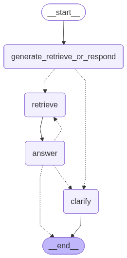

[](https://github.com/RobHaRepos/Chatbot-agentic-RAG/actions/workflows/ci-build.yaml) [](https://sonarcloud.io/summary/new_code?id=RobHaReposChatbotAgenticRag) [](https://snyk.io/test/github/RobHaRepos/Chatbot-agentic-RAG) [](https://www.python.org/) 

# Chatbot-agentic-RAG

A microservices-based RAG chatbot using LangGraph for workflow orchestration, FAISS for retrieval, and FastAPI for all service endpoints. Features include iterative LLM-driven retrieval, centralized logging with SSE streaming, and text-to-speech capabilities.

**Tech Stack:** Python 3.13 | FastAPI | LangGraph | FAISS | HuggingFace Transformers | OpenAI | Docker Compose

## Architecture

**Services:**
- **Workflow** (port 8000): LangGraph-based orchestration with `/run` and `/tts` endpoints
- **Retriever** (port 8001): FAISS vector search with sentence-transformers embeddings
- **LLM** (port 8002): ChatOpenAI wrapper for answer generation and retrieval decisions
- **Frontend** (port 8003): Static HTML/JS UI with TTS playback
- **Logger** (port 8004): Centralized log collection with SSE streaming
- **TTS** (port 8005): External Kokoro TTS service (optional)



## Quick Start

```powershell
# Set required environment variables
$env:OPENAI_API_KEY = "your-key-here"
$env:PATH_TO_FAISS_INDEX = "./faiss_Hugging_index"

# Build and run all services
docker compose build --no-cache --pull
docker compose up -d

# Verify health
curl http://localhost:8000/health  # workflow
curl http://localhost:8003          # frontend
```

Access the UI at `http://localhost:8003`

## Project Structure

```
app/
├── langgraph_code/      # Workflow orchestration
│   ├── workflow.py      # LangGraph state machine
│   ├── nodes.py         # Node implementations
│   ├── wf_api.py        # Main FastAPI app
│   └── tts_api.py       # TTS proxy endpoint
├── llm/                 # LLM service
├── rag/                 # Retriever service  
├── frontend/            # Static UI
└── logger_service/      # Centralized logging
tests/                   # Unit & integration tests
docker-compose.yml       # Service orchestration
```

## How It Works

1. **User submits question** → Workflow invokes LLM to decide next action (retrieve/answer/clarify)
2. **LLM requests retrieval** → Workflow calls FAISS retriever with targeted query
3. **Documents returned** → LLM evaluates if sufficient to answer (iterates up to 5x)
4. **Final answer generated** → Response includes answer, context, and retrieval count
5. **TTS playback** → Optional audio synthesis via speaker button in UI

The LLM maintains a `context` summary across iterations to track gathered information and avoid redundant retrievals.

## API Endpoints

**Workflow Service** (`/`)
- `POST /run` - Execute RAG workflow: `{"question": "...", "k": 3}`
- `POST /tts` - Synthesize speech: `{"text": "...", "voice": "am_onyx", "speed": 1.0}`
- `GET /health`, `GET /ready` - Health checks

**LLM Service** (`/`)
- `POST /retrieve_or_respond` - Decide next action
- `POST /generate_answer` - Generate final answer

**Retriever Service** (`/`)
- `POST /retrieve_documents_string` - FAISS search

**Logger Service** (`/`)
- `POST /logs` - Submit logs
- `GET /stream` - SSE log stream

## Configuration

**Environment Variables:**
- `OPENAI_API_KEY` - Required for LLM service
- `PATH_TO_FAISS_INDEX` - Path to FAISS index directory
- `LANGGRAPH_LLM_API_URL` - LLM service URL (default: `http://localhost:8002`)
- `LANGGRAPH_RETRIEVER_API_URL` - Retriever URL (default: `http://localhost:8001`)
- `TTS_SERVICE_URL` - TTS service URL (default: `http://tts_service:8005`)
- `MODEL_NAME_LLM`, `TEMPERATURE_LLM`, `MAX_TOKENS` - LLM configuration

## Development

**Run tests:**
```powershell
pytest                    # All tests
pytest tests/test_llm.py  # Specific module
pytest --cov=.            # With coverage
```

**Local development without Docker:**
```powershell
# Install dependencies
pip install -r requirements.txt

# Run services individually
uvicorn app.rag.retriever:app --port 8001
uvicorn app.llm.llm_api:app --port 8002
uvicorn app.langgraph_code.wf_api:app --port 8000
```

## CI/CD & Security

- **GitHub Actions**: Automated testing with ruff linting and pytest
- **SonarQube Cloud**: Code quality and security analysis
- **Snyk**: Dependency vulnerability scanning

All Docker containers run as non-root `appuser` for security.

## Text-to-Speech Setup

1. Run external Kokoro TTS service on port 8005
2. Configure Docker networks: add `tts_kokoro_network` to langgraph service
3. Set `TTS_SERVICE_URL` environment variable
4. Click speaker icons in UI to play audio

**Note:** HTTP is used for internal Docker communication as services are network-isolated.

## AI-Assisted Development

The React frontend was developed with GitHub Copilot as an experiment in AI-accelerated learning. See [AI_DEVELOPMENT.md](AI_DEVELOPMENT.md) for details on this approach and insights gained.
